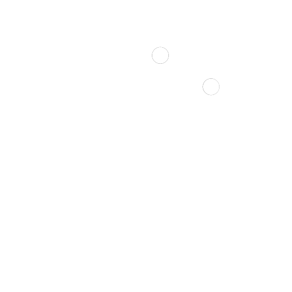
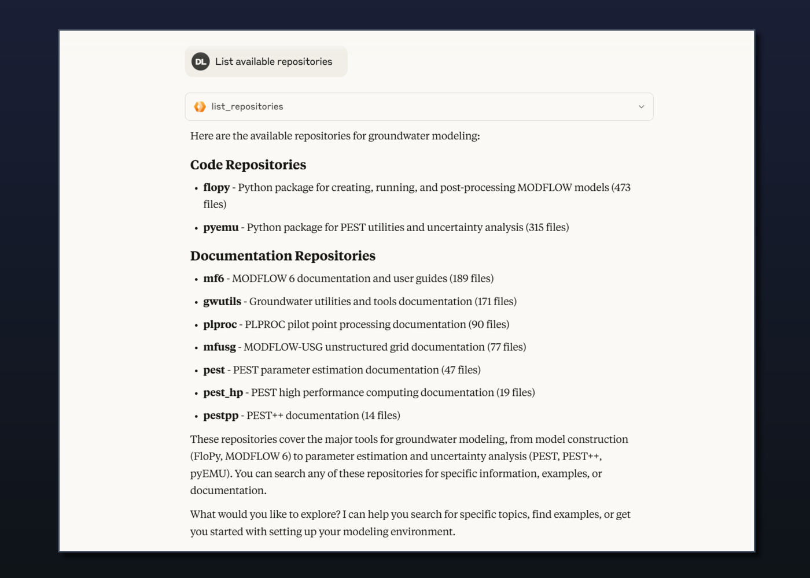

  

 

# MODFLOW-AI MCP Server (Alpha)

🚧 **Early Access Program** - Currently in alpha testing with limited availability.

Transform your AI assistant into a groundwater modeling expert with the MODFLOW-AI MCP Server. Access comprehensive documentation from 9+ major groundwater modeling tools directly through Claude, Cursor, or other MCP-compatible AI assistants.

## 🌟 Project Status

- 🟡 **Alpha Testing Phase** - Active development with community feedback
- 📋 **Waitlist Access** - Limited availability during early testing
- 🔄 **Frequent Updates** - New features and improvements regularly added
- 💬 **Feedback Welcome** - Help shape the future of AI-assisted groundwater modeling

## 📺 See It In Action

*Access 9+ groundwater modeling tools and documentation repositories through simple queries*

### Watch Demo Videos:
- 🎥 [MODFLOW 6 Particle Tracking Tutorial](https://vimeo.com/1039073889)
- 🎥 [PEST++ Optimization Setup](https://vimeo.com/1039073840)
- 🎥 [PFAS Contamination Modeling](https://vimeo.com/1039073852)
- 🎥 [PEST_HP Parallel Calibration](https://vimeo.com/1039073843)

## 🎯 What is MODFLOW-AI MCP Server?

MODFLOW-AI MCP Server is a hosted service that provides AI assistants with deep knowledge of groundwater modeling tools. Built on the [Model Context Protocol (MCP)](https://modelcontextprotocol.io/), it enables natural language access to technical documentation and modeling workflows.

### Key Features (Alpha)

- **Multi-Repository Search**: Access documentation from MODFLOW 6, PEST++, FloPy, and more
- **Natural Language Queries**: Ask questions in plain English
- **Smart Search**: Both text and semantic search capabilities
- **Modeling Workflows**: Step-by-step guidance for creating groundwater models
- **OAuth Authentication**: Secure access with GitHub or Google accounts

## 🚀 Getting Started

### 1. Join the Waitlist

Visit [www.modflow.ai/login](https://www.modflow.ai/login) to request access. You'll receive configuration instructions via email once approved.

### 2. Compatible AI Assistants

**HTTP Transport** (Direct connection):
- ✅ VS Code
- ✅ Cursor

**MCP-Remote Required**:
- ✅ Claude Desktop
- ✅ Claude.ai (Claude Code)
- ✅ Windsurf

### 3. Configuration

After receiving your access email, configure your AI assistant using the provided endpoint. Detailed instructions are included in the welcome email.

## 📚 Available Tools

### Repository Access
- **list_repositories** - View all available documentation sources
- **text_search_repository** - Search for specific terms and functions
- **semantic_search_repository** - Find conceptual explanations
- **get_file_content** - Retrieve specific documentation files

### Model Building (Advanced Users)
- **setup_flopy_workspace** - Configure Python environment
- **download_modflow_executable** - Get MODFLOW executables
- **get_flopy_examples_info** - Access example models
- **download_pestpp_executable** - Get PEST++ for calibration

## 💡 Usage Tips

### ✅ Do:
- Focus queries on one repository at a time for best results
- Use specific technical terms when searching (e.g., "WEL package" not "wells")
- Start with `list_repositories` to explore available resources
- Use `get_repository_navigation` before searching (provides repository-specific tips)
- Ask follow-up questions to refine results

### ⚠️ Avoid These (Standard Context Engineering Best Practices):
*These are typical recommendations for any MCP-based tool to ensure optimal results*
- Ask multiple complex questions across different repositories in one query
- Skip the exploration phase if you're new to groundwater modeling
- Expect perfect results for very broad conceptual questions (be specific!)
- Use generic terms when technical terms exist

### 🎓 Example Queries

**Good Examples:**
- "Search for streamflow routing in mf6"
- "How do I set up particle tracking with MODPATH 7?"
- "Find the obs2obs utility in gwutils"
- "Show me MODFLOW 6 lake package examples"

**Less Effective:**
- "Tell me everything about groundwater modeling"
- "Search all repositories for flow"
- "How does water work?"

## 🔍 Current Limitations (Alpha)

- **Single Repository Focus**: Best results when querying one repository at a time
- **Search Refinement**: Complex multi-concept searches may need iteration
- **Response Times**: May vary during peak usage or large result sets
- **Documentation Coverage**: Continuously expanding indexed content
- **Platform Support**: Some MCP clients still in testing

## 🛡️ Security & Privacy

- **Complete Privacy**: Your queries are never stored, logged, or accessed by any means
- **Zero Data Retention**: No query history, no response logging, no analytics tracking
- **OAuth 2.0 Authentication**: Secure login via GitHub or Google (only for access control)
- **Read-Only Access**: Cannot modify your data or repositories
- **End-to-End Encryption**: All communications use HTTPS
- **No Third-Party Access**: Your modeling questions remain completely confidential

## 📊 Repositories Available

### Code Repositories
- **FloPy** - Python package for creating MODFLOW models
- **pyEMU** - Python tools for uncertainty analysis

### Documentation Repositories
- **MODFLOW 6** - USGS modular groundwater flow model
- **MODFLOW-USG** - Unstructured grid version
- **PEST** - Parameter estimation toolkit
- **PEST++** - Next-generation PEST tools
- **PEST_HP** - High-performance computing version
- **gwutils** - Groundwater utility programs
- **plproc** - Pilot point processor

## 🐛 Known Issues (Alpha)

1. **Complex Queries**: Multi-repository searches may return mixed results
2. **Large Results**: Some searches may timeout with extensive matches
3. **Navigation Tool**: Output is for AI use only (not user-friendly)
4. **Platform Differences**: Configuration varies by AI assistant

## 💬 Feedback & Support

This is an alpha release and we value your input:

- **Report Issues**: Reply to your access email
- **Feature Requests**: Share what would help your workflow
- **Success Stories**: Let us know what's working well
- **Documentation**: Suggest improvements or corrections

## 🗺️ Roadmap

### Currently Working On:
- [ ] Expanded documentation coverage (legal risk groundwater modeling corpus)

### Under Consideration:
- [ ] Unifying tools into a single, more powerful tool

## 📄 License & Terms

MODFLOW-AI MCP Server is a proprietary hosted service. By using this service, you agree to:
- Use the service responsibly and within rate limits
- Not attempt to reverse engineer or abuse the service
- Provide feedback to help improve the alpha version

The service is provided as-is during alpha testing. No source code is shared or licensed for redistribution.

For questions or access requests: [LinkedIn](https://www.linkedin.com/in/dlz800)

## 🙏 Acknowledgments

Built with data from:
- [USGS MODFLOW](https://www.usgs.gov/mission-areas/water-resources/science/modflow-and-related-programs)
- [FloPy Project](https://github.com/modflowpy/flopy)
- [PEST Suite](https://pesthomepage.org/)
- And the broader groundwater modeling community

---

**Note**: This is an alpha release. Features, performance, and documentation are actively evolving based on user feedback.

*For access, visit [www.modflow.ai/login](https://www.modflow.ai/login)*
