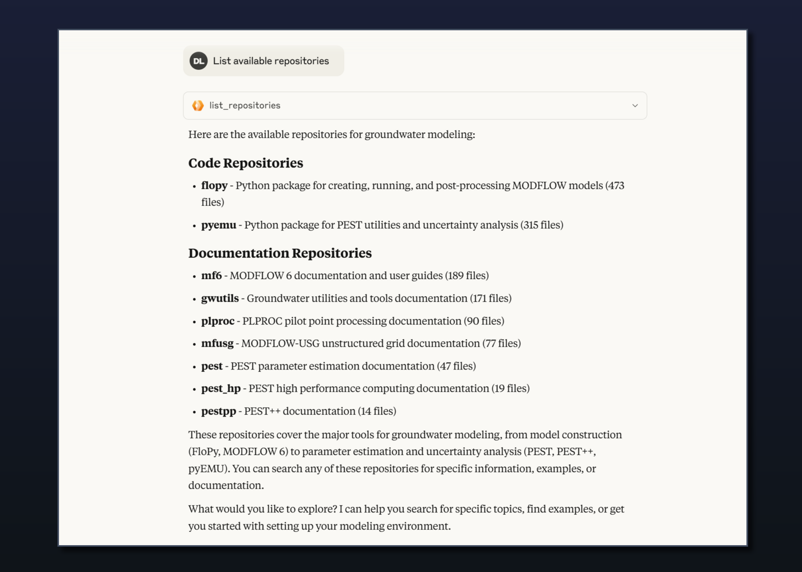

  

 

# MODFLOW-AI MCP Server (Alpha)

🚧 **Early Access Program** - Currently in alpha testing with limited availability.

Transform your AI assistant into a groundwater modeling expert with the MODFLOW-AI MCP Server. Access comprehensive documentation from 9+ major groundwater modeling tools directly through Claude, Cursor, or other MCP-compatible AI assistants.

## 🌟 Project Status

- 🟡 **Alpha Testing Phase** - Active development with community feedback
- 📋 **Waitlist Access** - Limited availability during early testing
- 🔄 **Frequent Updates** - New features and improvements regularly added
- 💬 **Feedback Welcome** - Help shape the future of AI-assisted groundwater modeling

## 📺 See It In Action

*Access 9+ groundwater modeling tools and documentation repositories through simple queries*

### Watch Demo Videos:
- 🎥 [MODFLOW 6 Particle Tracking Tutorial](https://vimeo.com/1039073889)
- 🎥 [PEST++ Optimization Setup](https://vimeo.com/1039073840)
- 🎥 [PFAS Contamination Modeling](https://vimeo.com/1039073852)
- 🎥 [PEST_HP Parallel Calibration](https://vimeo.com/1039073843)

## 🎯 What is MODFLOW-AI MCP Server?

MODFLOW-AI MCP Server is a hosted service that provides AI assistants with deep knowledge of groundwater modeling tools. Built on the [Model Context Protocol (MCP)](https://modelcontextprotocol.io/), it enables natural language access to technical documentation and modeling workflows.

### Key Features (Alpha)

- **Multi-Repository Search**: Access documentation from MODFLOW 6, PEST++, FloPy, and more
- **Natural Language Queries**: Ask questions in plain English
- **Smart Search**: Both text and semantic search capabilities with automatic method selection
- **Modeling Workflows**: Step-by-step guidance for creating groundwater models
- **OAuth Authentication**: Secure access with GitHub or Google accounts
- **Acronym Intelligence**: Automatic detection and expansion of MODFLOW/PEST acronyms

## 🚀 Getting Started

### 1. Join the Waitlist

Visit [www.modflow.ai/login](https://www.modflow.ai/login) to request access. You'll receive configuration instructions via email once approved.

### 2. Compatible AI Assistants

**HTTP Transport** (Direct connection):
- ✅ VS Code
- ✅ Cursor

**MCP-Remote Required**:
- ✅ Claude Desktop
- ✅ Claude.ai (Claude Code)
- ✅ Windsurf

### 3. Configuration

After receiving your access email, configure your AI assistant using the provided endpoint. Detailed instructions are included in the welcome email.

## 📚 Available Tools

### Primary Search Tools

#### search_docs
**Comprehensive search across ALL resources** (documentation, code, workflows)
- Searches documentation, Python modules, and tutorial notebooks
- Ultra-flexible repository parameter (arrays, comma/space/pipe-separated)
- Supports wildcards (*), Boolean operators (AND/OR/NOT)
- Automatically expands acronyms (UZF → Unsaturated Zone Flow)
- When no repository specified, searches EVERYTHING

#### search_code
**API and module search** for FloPy/PyEMU
- Searches Python implementations, classes, and functions
- Returns API signatures, parameters, and docstrings
- Includes package codes (WEL, RCH, etc.) and model families
- Direct GitHub links to source code

#### search_tutorials
**Tutorial and workflow search**
- Finds working examples, notebooks, and step-by-step guides
- Filters by complexity level (beginner to advanced)
- Shows prerequisites and common modifications
- Array search within use cases and implementation tips

### Semantic Search Tools

#### semantic_search_docs
**AI-powered conceptual search**
- Uses OpenAI embeddings for concept understanding
- Best for "how to" queries and exploratory research
- Finds related content even with different terminology

#### semantic_search_tutorials
**Semantic tutorial search**
- Domain-aware matching (uncertainty vs. flow modeling)
- Complexity-appropriate results
- Tool-specific implementations (PESTPP-IES, pyemu.ParameterEnsemble)

### Utility Tools

#### get_file_content
**Direct file retrieval**
- Retrieves complete file content by exact path
- Supports pagination for large files (>30KB)
- Returns full source code or documentation with metadata
- No truncation - handles files of any size

#### get_modflow_ai_info
**MODFLOW AI overview**
- Explains what MODFLOW AI is and its capabilities
- Lists all available repositories and tools
- Provides database statistics and usage guidance
- No parameters required

## 💡 Usage Examples

### How AI Agents Use These Tools

When you ask your AI assistant about groundwater modeling, it uses these MCP tools behind the scenes:

**User**: "How do I set up a pumping well in MODFLOW 6?"
**AI Agent calls**: `mcp__mfaitools__search_docs` with query="WEL package MODFLOW 6"
→ Returns: WEL package documentation, implementation examples, and API details

**User**: "Show me a beginner tutorial for FloPy"
**AI Agent calls**: `mcp__mfaitools__search_tutorials` with query="getting started" and complexity="beginner"
→ Returns: Step-by-step FloPy tutorials with working code

**User**: "Explain how particle tracking works in groundwater models"
**AI Agent calls**: `mcp__mfaitools__semantic_search_docs` with conceptual query
→ Returns: Theory and mathematical explanations of particle tracking

**User**: "I need the NPF package documentation file"
**AI Agent calls**: `mcp__mfaitools__get_file_content` with exact filepath
→ Returns: Complete NPF documentation with all equations and parameters

**User**: "What is MODFLOW AI?"
**AI Agent calls**: `mcp__mfaitools__get_modflow_ai_info`
→ Returns: Complete overview of MODFLOW AI capabilities and available resources

### Query Optimization Tips

✅ **Do:**
- Use `search_docs` without a repository parameter to search everything
- Use specific technical terms or acronyms (e.g., "UZF", "WEL package")
- Start with `get_modflow_ai_info` to understand available resources
- Use `semantic_search_docs` for conceptual questions
- Combine multiple tools for comprehensive results

⚠️ **Avoid:**
- Overlapping searches with the same query across multiple tools
- Using semantic search for exact function names (use `search_code` instead)
- Very broad conceptual questions (be specific!)
- Ignoring tool-specific strengths

## 📊 Available Repositories

### Code Repositories
- **FloPy** - Python package for creating MODFLOW models (modules and tutorials)
- **pyEMU** - Python tools for uncertainty analysis and PEST++ integration

### Documentation Repositories
- **MODFLOW AI** - MCP Server documentation and guides
- **MODFLOW 6** - USGS modular groundwater flow model
- **MODFLOW-USG** - Unstructured grid version
- **PEST** - Parameter estimation toolkit
- **PEST++** - Next-generation PEST tools
- **PEST_HP** - High-performance computing version
- **gwutils** - Groundwater utility programs
- **plproc** - Pilot point processor

## 🔍 Search Intelligence

### Acronym Recognition
The server recognizes common MODFLOW/PEST acronyms and automatically expands them:
- **WEL** → Well Package
- **RIV** → River Package
- **MAW** → Multi-Aquifer Well
- **CHD** → Constant Head Boundary
- **DRN** → Drain Package
- **EVT** → Evapotranspiration
- **RCH** → Recharge
- **SFR** → Streamflow Routing
- And many more...

### Smart Search Method Selection
The server automatically selects the optimal search method:
- **Text Search**: Used for exact terms, acronyms, or quoted phrases
- **Semantic Search**: Used for conceptual queries and "how to" questions
- **Hybrid Search**: Combines both methods for comprehensive results

### GitHub URL Generation
All code results include direct GitHub links:
- FloPy modules: `github.com/modflowpy/flopy/blob/develop/...`
- PyEMU modules: `github.com/pypest/pyemu/blob/develop/...`

## 🔍 Current Limitations (Alpha)

- **Large File Pagination**: Files over 30KB are paginated to avoid token limits
- **Search Refinement**: Complex multi-concept searches may need iteration
- **Response Times**: May vary during peak usage or large result sets
- **Documentation Coverage**: Continuously expanding indexed content
- **Platform Support**: Some MCP clients require MCP-Remote for connection

## 🛡️ Security & Privacy

- **Complete Privacy**: Your queries are never stored, logged, or accessed by any means
- **Zero Data Retention**: No query history, no response logging, no analytics tracking
- **OAuth 2.0 Authentication**: Secure login via GitHub or Google (only for access control)
- **Read-Only Access**: Cannot modify your data or repositories
- **End-to-End Encryption**: All communications use HTTPS
- **No Third-Party Access**: Your modeling questions remain completely confidential

## 🐛 Known Issues (Alpha)

1. **Large Files**: Files over 30KB require pagination (use page parameter in get_file_content)
2. **Platform Differences**: Some clients require MCP-Remote for connection
3. **Search Limits**: Default limits may need adjustment for comprehensive results
4. **Complex Queries**: Multi-concept searches may require refinement

## 💬 Feedback & Support

This is an alpha release and we value your input:

- **Report Issues**: Reply to your access email
- **Feature Requests**: Share what would help your workflow
- **Success Stories**: Let us know what's working well
- **Documentation**: Suggest improvements or corrections

## 🗺️ Roadmap

### Recently Completed (January 2025):
- ✅ Fixed file content pagination for large files
- ✅ Optimized page sizes for token limits
- ✅ Enhanced search_docs to search ALL content types
- ✅ Improved error handling for database queries

### Currently Working On:
- [ ] Expanded documentation coverage
- [ ] Performance optimizations for large result sets
- [ ] Enhanced semantic search capabilities

### Under Consideration:
- [ ] Unified super-tool combining all search capabilities
- [ ] Real-time model execution capabilities
- [ ] Integration with cloud modeling platforms

## 📄 License & Terms

MODFLOW-AI MCP Server is a proprietary hosted service. By using this service, you agree to:
- Use the service responsibly and within rate limits
- Not attempt to reverse engineer or abuse the service
- Provide feedback to help improve the alpha version

The service is provided as-is during alpha testing. No source code is shared or licensed for redistribution.

For questions or access requests: [LinkedIn](https://www.linkedin.com/in/dlz800)

## 🙏 Acknowledgments

Built with data from:
- [USGS MODFLOW](https://www.usgs.gov/mission-areas/water-resources/science/modflow-and-related-programs)
- [FloPy Project](https://github.com/modflowpy/flopy)
- [PEST Suite](https://pesthomepage.org/)
- And the broader groundwater modeling community

---

**Note**: This is an alpha release. Features, performance, and documentation are actively evolving based on user feedback.

*For access, visit [www.modflow.ai/login](https://www.modflow.ai/login)*
